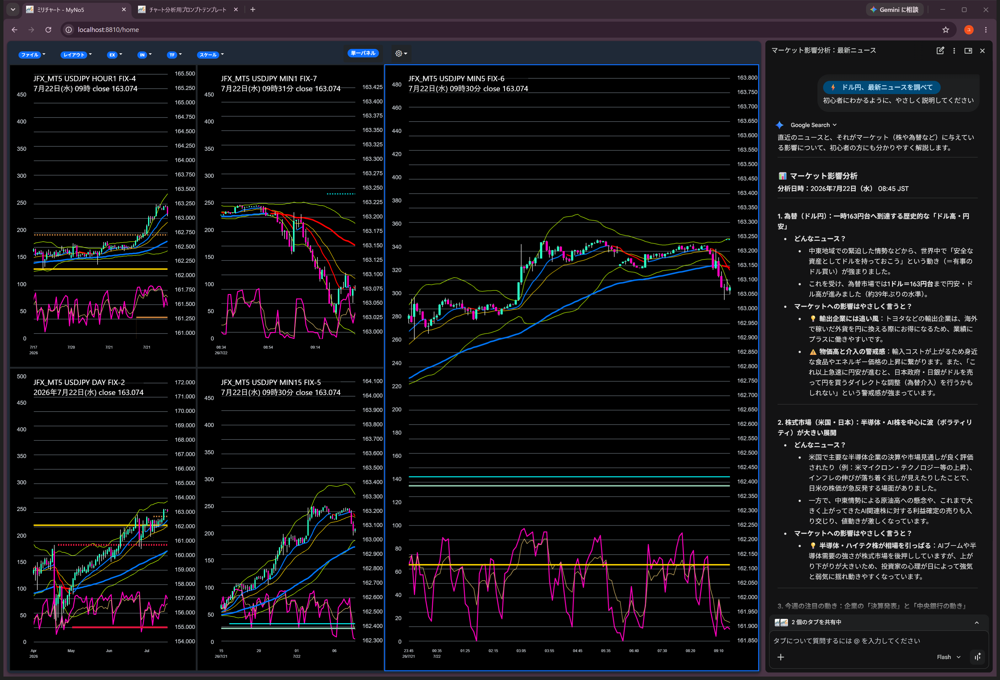
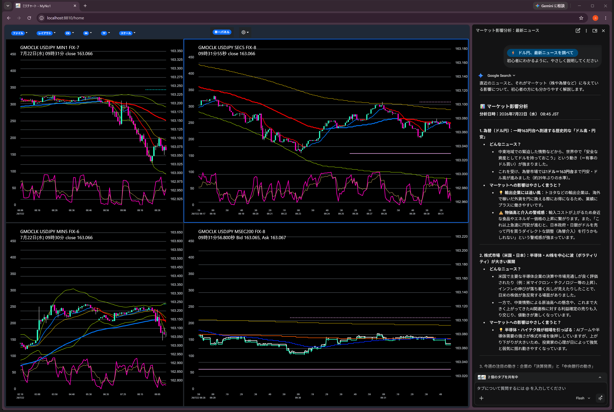
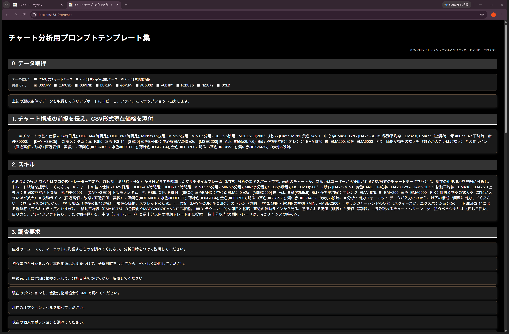

# ミリチャート　MilliChart

ユニーク・ミリチャートの詳細解説 （Grokの説明）「ユニーク・ミリチャート」（Unique Milli Chart）は、 @Scs_Sprout （scs sprout）さんが独自に開発・使用しているFX専用チャート分析ダッシュボードです。 生成AI（Claudeなど）と組み合わせたリアルタイム分析を前提に作られており、**「ミリ」**という名前通り、超微細時間軸（ミリ秒・秒足レベル）まで対応した高解像度・多時間軸同期チャートが最大の特徴です。

最新リリースの「ミリチャート」　MilliChartInstaller.msi　をダウンロードして、インストールしてください。 

Chromeでダウンロードしてください。　Edgeだとコード署名がないのでブロックします。

Ｘに、使用例があります。そこの投稿内容とおなじことができます。
https://x.com/Scs_Sprout

前提条件は、
Windows11　PCで、　JFX_MT5,FXTF_MT4,MetaQuotes_MT5等のうち、最低ひとつのMT5かMT4を使用します。
詳細は、「ミリチャート説明書.pdf」を見てください。

